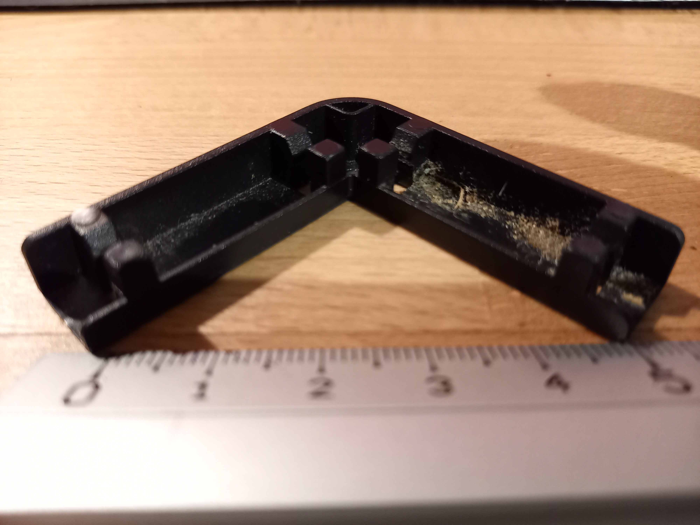
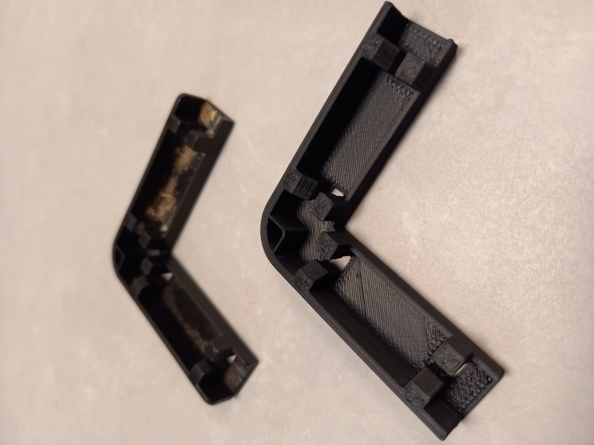
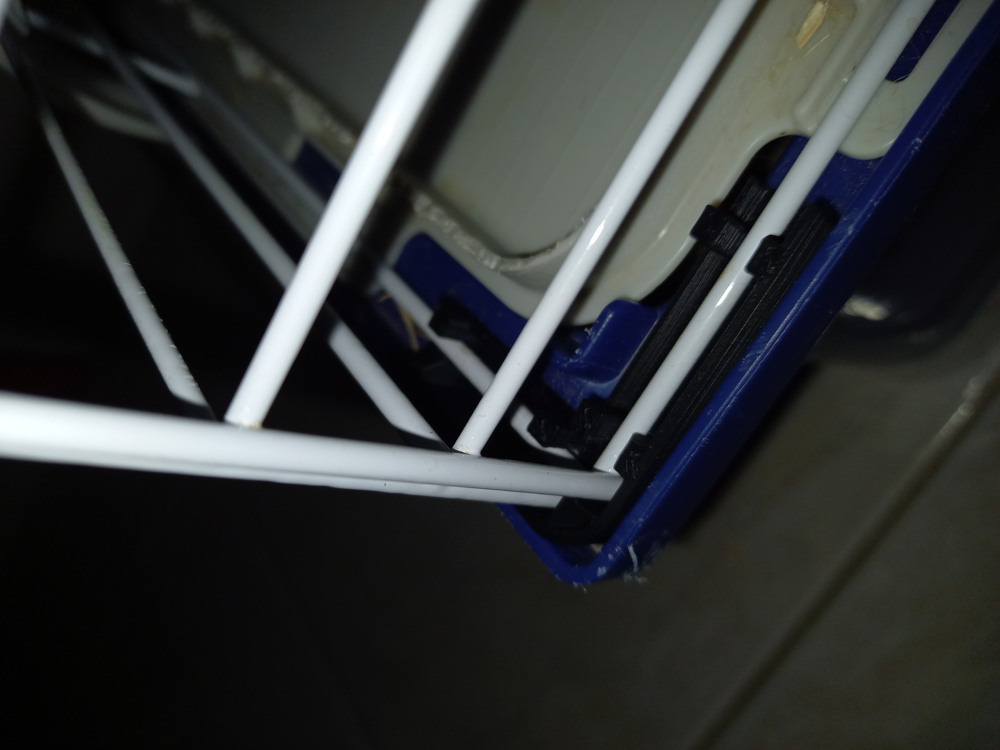

# Coin d'assemblage de deux grilles d'une cage à lapin.

**License**: CC-BY-SA 4.0  This work is licensed under a [Creative Commons Attribution-ShareAlike 4.0 International License](http://creativecommons.org/licenses/by-sa/4.0)

## Description

La cage des lapins comporte des grilles assemblées à angle droit, clipsées sur des coins en plastique.
L'un de ces coins a disparu. On ne les trouvent pas au détail dans le commerce.

<figure>
    
    <figcaption><i>Un coin d'assemblage</i></figcaption>
</figure>

Cette pièce comporte 2 bras perpendiculaires. Sur chacun, 4 éléments permettent de clipser une grille métallique.
A la jonction des 2 bras, le coin est arrondi, et sur l'intérieur de l'arrondi une butée permet d’empêcher les grilles de bouger.

## Modèle 3D 

La pièce a été modélisée avec le logiciel OpenSCAD. Le fichier est [ici](coin_grille_cage_lapin.scad).
<figure>
    
    <figcaption><i>Le modèle 3D (.scad) dans OpenSCAD</i></figcaption>
</figure>

## Impression 3D

Le modèle est exporté au format STL pour l'impression 3D.
<figure>
    
    <figcaption><i>Le modèle 3D (.stl) dans Repetier-Host</i></figcaption>
</figure>

<figure>
    
    
    <figcaption><i>Le pièce imprimée et mise en place</i></figcaption>
</figure>

## Conclusion

Temps passé pour faire le modèle 3D : 8 à 10h, à la louche
Temps d'impression : 37 minutes
Coût de l'impression : 1,30€

## Évolutions possibles

Resserrer un peu les clips car les grilles se déclipsent un peu trop facilement.

## Bibliographie

- Formation OpenSCAD - FabLab Lannion: https://wiki.fablab-lannion.org/index.php?title=OpenSCAD
- L'antisèche OpenSCAD: http://openscad.org/cheatsheet/
- Description de l'imprimante 3D DeltaRework - FabLab Lannion: https://wiki.fablab-lannion.org/index.php?title=DeltaRework